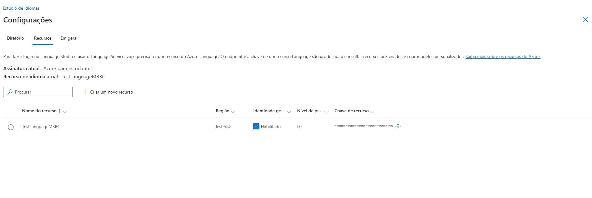
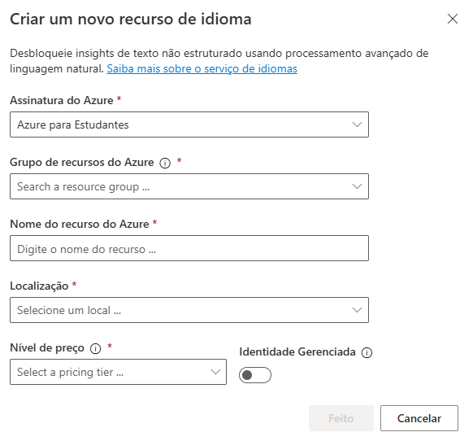
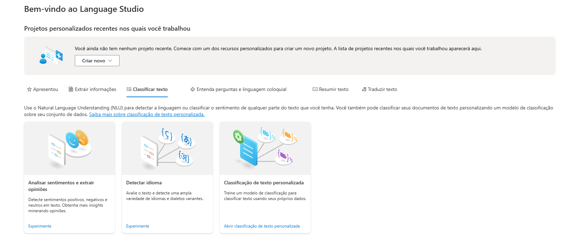
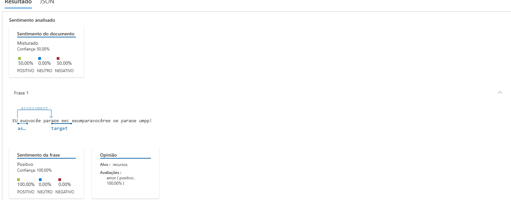

# Tutorial: Análise de Sentimentos com Language Studio no Azure AI

Neste tutorial, irei compartilhar o processo de como utilizei o **Language Studio** da **Azure AI** para analisar sentimentos de frases. A seguir, mostro os passos seguidos para configurar e utilizar a ferramenta, além de exemplos dos resultados obtidos.

## Passo 1: Criando um Novo Recurso

O primeiro passo é criar um novo recurso no **Language Studio**. Para isso, siga as etapas abaixo:

1. Clique na engrenagem do **Language Studio**.
2. Selecione a opção **Recursos**.
3. Clique em **Criar Novo Recurso**.

## Passo 2: Selecionando "Analisar Sentimentos e Extrair Opiniões"

Após criar o recurso, você precisará selecionar a funcionalidade **"Analisar Sentimentos e Extrair Opiniões"**. Siga os passos abaixo:

1. Clique na opção **"Analisar Sentimentos e Extrair Opiniões"**.

## Passo 3: Inserindo Frases para Análise

Ao clicar na opção, você será redirecionado para uma tela onde poderá inserir as frases que deseja analisar. Na tela, você verá dois campos principais:

- **Idioma**: Selecione o idioma desejado.
- **Input**: Insira as frases para que a IA analise os sentimentos.

### Exemplo de Frases Inseridas

Aqui está um exemplo do que inseri no campo de entrada para análise de sentimentos:

## Passo 4: Executando a Análise de Sentimentos

Após inserir as frases, role para baixo até encontrar o botão **"Run"** para executar a análise. Clique nele para iniciar o processo.

## Passo 5: Resultados da Análise

Após a execução, os resultados da análise de sentimentos serão exibidos. Você verá os sentimentos atribuídos às frases, como **positivo**, **negativo** ou **neutro**.

